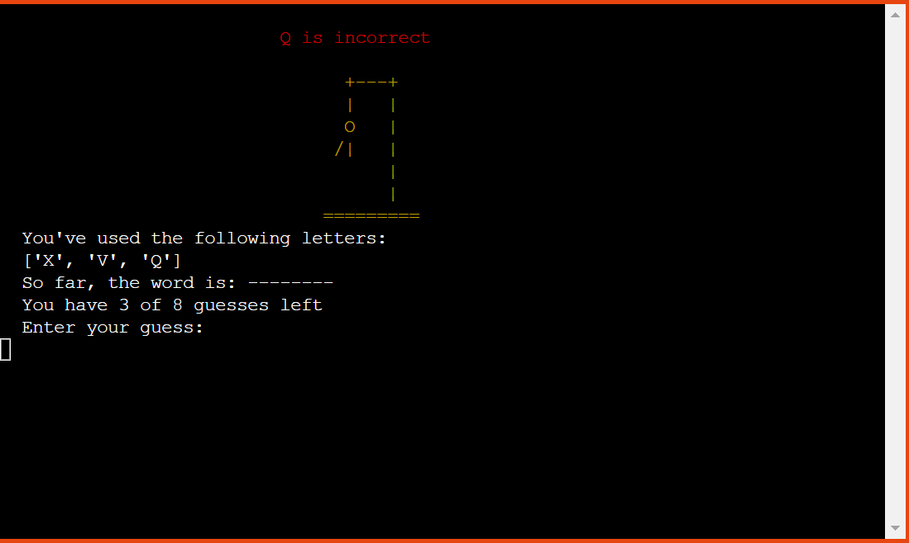
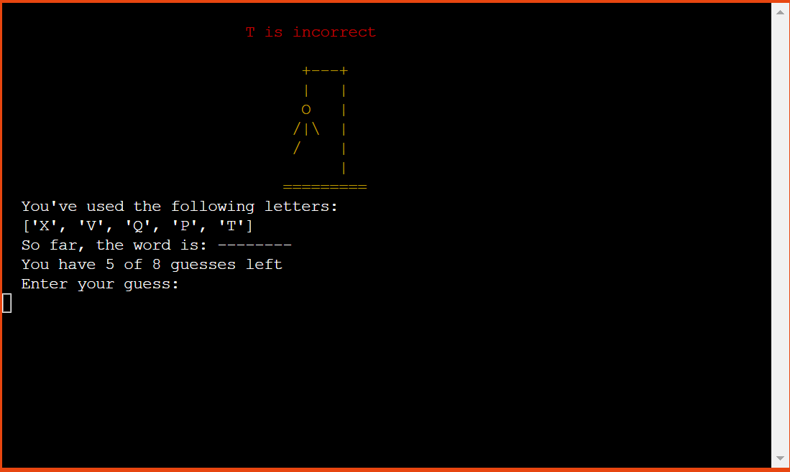

# Hangman - Game

# Introduction
Project milestone 3 for Code Institute Full-stack development program: Python Terminal. <brZ>
This project was created by myself to show a simple game using python and ran through heroku. The main goal of the game is to guess letters in order to find the word that the computer randomly selects. 

[Live Project Here](https://hang-man-mp3.herokuapp.com/)

## README Table Content

* [Introduction](#introduction)
* [User Experience UX](#user-experience---UX)
* [Design](#Design)
    * [Colours](#Colours)
* [Logic](#logic)
     * [Flowcharts](#flowcharts)

* [Game Features](#Game-Features)
    * [Logo and Game Options](#Logo-and-Game-Options) 
    * [Hangman Stage 1](#Hangman-Stage-1)
    * [Hangman Stage 2](#Hangman-Stage-2) 
    * [Hangman Stage 3](#Hangman-Stage-3)
    * [Hangman Stage 4](#Hangman-Stage-4)
    * [Hangman Stage 5](#Hangman-Stage-5)
    * [Hangman Stage 6](#Hangman-Stage-6)
    * [Hangman Stage 7](#Hangman-Stage-7)
    * [Hangman Stage 8](#Hangman-Stage-8)
    * [Hangman Stage 9-Lose](#Hangman-Stage-9-Lose)
    * [Hangman Stage 9-Win](#Hangman-Stage-9-Win)
    * [Menu Options](#Menu-Options)
    * [Game Rules](#Game-Rules)
    * [Exit Game](#Exit-Game)
    * [How to Play](#how-to-play)
* [Technologies Used](#technologies-used)
    * [Languages Used](#languages-used)
    * [Python Packages](#Python-Packages)
    * [Frameworks - Libraries - Programs Used](#frameworks---libraries---programs-used)
* [Testing](#testing)
    * [CI Python LinterEP8](#CI-Python-LinterEP8)
    * [Lighthouse](#Lighthouse)
    * [Functionality](#Functionality)
    * [Bugs](#Bugs)
* [Deploying this Project](#deployment-this-project)
    * [Forking this Project](#forking-this-project)
    * [Cloning this Project](#cloning-this-project)
* [Credits](#credits)
## User Experience - UX

### User Stories

* As a website creator, I want to:
  
1. I want to build an game to navigate.
2. I want to build a simple game to understand.
3. I want to build a game with images being visible which changes when the user progresses
4. I want to build a game that keeps score
   
* As a first time user, I want to:

1. As a First Time user, i want the program to be easy to navigate
2. As a First Time user, i want to be able to see the progress of the hangman image displayed at all stages.
3. As a First Time user, i want to be shown progress in letters i've selected.
4. As a First Time user, i want to advised if an incorrect input has been selected.
   
* As a returning visitor, I want to:

1. As a Returning user, be able to play the game again with a different word as chosen by the computer.
2. As a Returning user, I want to be able to navigate through the app consistently.
3. As a Returning user, I want to beat my previous score.
   
## Design

#### Colours
* A Sort red was chosen as a background to make the app stand out from the page and Python Colorama Model was installed in which some simple colours were chosen to make the app more visually appealing.
The colours in the game are supplied by the Python Colorama Model

### Flowcharts 
<!--  
I spent time planning and thinking about the logic and flow behind the game to ensure I had a general idea of how it could be built. I created flowcharts to assist me with the logical flow throughout the application. The charts were generated using [Lucidchart](https://lucid.app/) Integration and are shown below.  -->

## Features

### Logo and Game Options

* When opening the app, the user will be shown the a logo along along with the 
Game Options menu.  

### Play Game

* After the player sees the intro feature, the computer will ask the user's to input their name and city. 

### Rules

* If the player does not input their name and city, this alert will appear. 

### Close Game

* After the user inputs their name and city, the program will display the welcome message and the game rules. The player then presses any key to start the game. 

## Game Features

### Hangman Stage 1
  

A welcome message along with prompt to guess the word. The Hangman design is placed below the welcome prompt. The user then has a list of information to assist with the game. They are as foolow:
* Letters already guessed
* Correct guessed letters
* Number of guesses
* A prompt to have a guess
* An Input to guess a letter or the full word

A confirmation message is displayed over the hangman image once a leeter or word is selected. This is displayed as green for a correct letter or word, red for an incorrect letter or word and white for an invalid input.

### Hangman Stage 2 

  
* When the player guesses a letter or word which is not in the word, the head part of the hangman image is displayed and The display stays green

### Hangman Stage 3

* When the player guesses a second letter or word which is not in the word, the body part of the hangman image is displayed and The display stays green

### Hangman Stage 4

* When the player guesses a third letter or word which is not in the word, the left arm part of the hangman image is displayed and The display colour changes to yellow

### Hangman Stage 5

* When the player guesses a fourth letter or word which is not in the word, the right arm part of the hangman image is displayed and The display colour stays yellow

### Hangman Stage 6

* When the player guesses a fifth letter or word which is not in the word, the left leg part of the hangman image is displayed and The display stays yellow

### Hangman Stage 7

* When the player guesses a sixth letter or word which is not in the word, the right leg part of the hangman image is displayed and The display colour changes to red

### Hangman Stage 8

* When the player guesses a seventh letter or word which is not in the word, the right foot part of the hangman image is displayed and The display colour stays red

### Hangman Stage 9/Lose

* When the player guesses a eigth letter or word which is not in the word, the hamgman design is fully complete and The display colour stays red.

### Hangman Stage 9/Win

* If the player guessed the full word, they have won the game. When this happens, a prompt that the user has won along with the total points for the game.

### Menu Options

* At the start and end of a game, users will have access to the menu where they can choose from these options:  
[A] - Play Game  
[B] - Game Rules  
[C] - Exit Game

### Game Rules

* The game rules appears will the user selects [B].

### Exit Game

* The players will see this message if they will chose to exit the game by typing [C].

### How to Play
 
 
 
 
 
 
 
 
* On opening a game, the user will see a prompt welcoming them to the game[1]
The player has 8 lives[5] in which he must slect a letter or guess the word the computer has randamly selected. This list is under data.txt. 
* The player can see how many letters are in the word[4] by the spaces displayed. The computer will ask the player to input a letter or a word [7],[6].
* If the user guesses a correct letter, they will see a message from the computer [7] the letter guessed displayed in the word length [4], the hangman stage will remain the same [2].
* If the user guesses an incorrect letter, a message from the computer [9] will display and the incorrect letter will be added to the incorrect letter list [3], the hangman stage will turn to the next stage [2] and the number of guesses will increase by 1 [5]
* When the player types an invalid input, they will see a message from the computer [8].
* When the user guesses the right word they will see a prompt notification along with the total score[10]!
* If the user guessed the full word at once, they will win recive an extra 300 points feature[11]
* 8 letters incorrectly guessed and the player will see a notifcation that they have lost.!

## Technologies Used
### Languages Used 

* [Python](https://www.python.org/)

#### Python Packages

* [Random](https://docs.python.org/3/library/random.html?highlight=random#module-random): returns a random integer to get a random word
* [os](https://docs.python.org/3/library/os.html): This was used to clear the screen after an input was selected
* [Colorama](https://pypi.org/project/colorama/): This package allows me to add colour and styles to the terminal.
  
### Frameworks - Libraries - Programs Used

* [Git](https://git-scm.com/)
    * Git was used for version control by utilizing the Gitpod terminal to commit to Git and push to GitHub
* [GitHub](https://github.com/)
    * GitHub is used to store the project's code after being pushed from Git
* [Heroku](https://id.heroku.com)
    * Heroku was used to deploy the live project
* [Lucidchart](https://lucid.app/)
    * Lucidchart was used to create the flowchart
* [CI Python LinterEP8](https://pep8ci.herokuapp.com/)
    * The PEP8 was used to validate all the Python code

## Testing

### CI Python LinterEP8

The [CI Python LinterEP8](https://pep8ci.herokuapp.com/) This linter is a Code Institute designed app to verify python code.

.
.
* No errors or warnings were found in the run.py page. The design.py page returned only advisory comments due to the characters used to design the images for display but no errors were returned.
  
### Lighthouse 

 Google Lighthouse in Google Chrome Developer Tools was used to test the performance of the website. 

* Desktop Results:

  .

  ## Functionality 
* No terminal issues and return values are correct 
* All design images display correctly
* All game rules come back with no errors
* All statements print correctly
* Correct values are displayed when a game is completed
* Rules option displays wit no issues
* No issue can be found and game works as expected

## Bugs 

| **Bug** | **Fix** |
| ----------- | ----------- |
| Random word not changing after first completed game | Defined a function for the word to be refreshed correctly |
| Rules design image not displaying correctly | Added as list in error  |
| Favicon not appearing | Changed location to a hyperlink refrence    |

## Deploying this Project

* This site was deployed by completing the following steps:

1. Log in to [Heroku](https://id.heroku.com) or create an account
2. On the main page click the button labelled New in the top right corner and from the drop-down menu select Create New App
3. You must enter a unique app name
4. Next select your region
5. Click on the Create App button
6. The next page is the project’s Deploy Tab. Click on the Settings Tab and scroll down to Config Vars
7. Click Reveal Config Vars and enter port into the Key box and 8000 into the Value box and click the Add button
8. Click Reveal Config Vars again and enter CREDS into the Key box and the Google credentials into the Value box
9. Next, scroll down to the Buildpack section click Add Buildpack select python and click Save Changes
10. Repeat step 8 to add node.js. o Note: The Buildpacks must be in the correct order. If not click and drag them to move into the correct order
11. Scroll to the top of the page and choose the Deploy tab
12. Select Github as the deployment method
13. Confirm you want to connect to GitHub
14. Search for the repository name and click the connect button
15. Scroll to the bottom of the deploy page and select the preferred deployment type
16. Click either Enable Automatic Deploys for automatic deployment when you push updates to Github

## Forking This Project

* Fork this project by following the steps:

1. Open [GitHub](https://github.com/)
2. Click on the project to be forked
3. Find the Fork button at the top right of the page
4. Once you click the button the fork will be in your repository

## Cloning This Project

* Clone this project by following the steps:
  
1. Open [GitHub](https://github.com/)
2. Click on the project to be cloned
3. You will be provided with three options to choose from, HTTPS, SSH, or GitHub CLI, click the clipboard icon in order to copy the URL
4. Once you click the button the fork will be in your repository
5. Open a new terminal
6. Change the current working directory to the location that you want the cloned directory
7. Type git clone and paste the URL copied in step 3
8. Press Enter and the project is cloned

## Credits

### Design Images
- [Hangman Logo Design](./assets/images/features/hm-home_screen.png): Design by <a href="https://replit.com/@SwaritChoudhari"> Swarit Choudhari </a>found in:<a href="https://replit.com/talk/share/Hangman-With-Graphics/115862">Replit</a>
- [Rules Design](./assets/images/features/hm-rules-2.png): Design by <a href="https://github.com/PedroCristo/portfolio_project_3/commits?author=PedroCristo">PedroCristo </a> found in <a href="https://portfolio-project-3.herokuapp.com/">Hangman Website</a>

### Code
- The inital code was adapted from MJ Codes in his python tutorials video: [Python Hangman](https://www.youtube.com/watch?v=wmSysRui0cI)
- The words i used to randomize were copied from the website trinket.io: [Put Interactive Python Anywhere on the Web](https://trinket.io/python/99f458ee11)
- My README.md was based off the template illastrated by [PedroCristo](https://github.com/PedroCristo/portfolio_project_3)