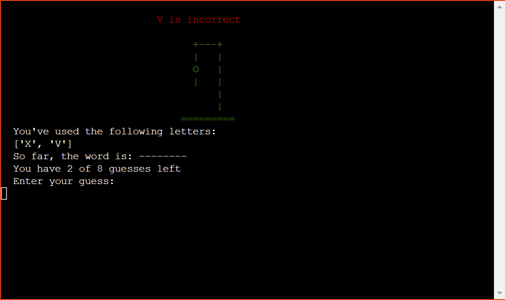

# Hangman - Game

# Introduction
Project milestone 3 for Code Institute Full-stack development program: Python Terminal. <brZ>
This project was created by myself to show a simple game using python and ran through heroku. The main goal of the game is to guess letters in order to find the word that the computer randomly selects. 

[Live Project Here](https://hang-man-mp3.herokuapp.com/)

## README Table Content

* [Introduction](#introduction)
* [User Experience UX](#user-experience---UX)
* [Design](#Design)
    * [Colours](#Colours)
* [Logic](#logic)
     * [Flowcharts](#flowcharts)

* Game Features
    * [Logo and Intro Message](#Logo-and-Intro-Message) 
    * [Hangman Stage 1](#Hangman-Stage-1)
    * [Hangman Stage 2](#Hangman-Stage-2) 
    * [Hangman Stage 3](#Hangman-Stage-3)
    * [Hangman Stage 4](#Hangman-Stage-4)
    * [Hangman Stage 5](#Hangman-Stage-5)
    * [Hangman Stage 6](#Hangman-Stage-6)
    * [Hangman Stage 7](#Hangman-Stage-7)
    * [Hangman Stage 8 - Lose](#Hangman-Stage-8---Lose)
    * [Hangman Stage 9 - Win](#Hangman-Stage-9---Win)
    * [Hangman Stage 10 - Win Extra](#Hangman-Stage-10---Win-Extra)
    * [Menu Options](#Menu-Options)
    * [Game Rules](#Game-Rules)
    * [Exit Game](#Exit-Game)
    * [How to Play](#how-to-play)
* [Storage Data](#Storage-Data)
* [Technologies Used](#technologies-used)
    * [Languages Used](#languages-used)
    * [Python Packages](#Python-Packages)
    * [Frameworks - Libraries - Programs Used](#frameworks---libraries---programs-used)
* [Testing](#testing)
    * [PEP 8 Online](#PEP-8-Online)
    * [Lighthouse](#Lighthouse)
    * [Functionality](#Functionality)
    * [Bugs](Bugs
* [Deploying this Project](#deployment-this-project)
    * [Forking this Project](#forking-this-project)
    * [Cloning this Project](#cloning-this-project)
* [Credits](#credits)
* [Content](#content)
## User Experience - UX

### User Stories

* As a website creator, I want to:
  
1. I want to build an game to navigate.
2. I want to build a simple game to understand.
3. I want to build a game with images being visible which changes when the user progresses
4. I want to build a game that keeps score
   
* As a first time user, I want to:

1. As a First Time user, i want the program to be easy to navigate
2. As a First Time user, i want to be able to see the progress of the hangman image displayed at all stages.
3. As a First Time user, i want to be shown progress in letters i've selected.
4. As a First Time user, i want to advised if an incorrect input has been selected.
   
* As a returning visitor, I want to:

1. As a Returning user, be able to play the game again with a different word as chosen by the computer.
2. As a Returning user, I want to be able to navigate through the app consistently.
3. As a Returning user, I want to beat my previous score.
   
## Design

#### Colours
* A Sort red was chosen as a background to make the app stand out from the page and Python Colorama Model was installed in which some simple colours were chosen to make the app more visually appealing.
The colours in the game are supplied by the Python Colorama Model

### Flowcharts 
<!--  
I spent time planning and thinking about the logic and flow behind the game to ensure I had a general idea of how it could be built. I created flowcharts to assist me with the logical flow throughout the application. The charts were generated using [Lucidchart](https://lucid.app/) Integration and are shown below.  -->

## Features

### Logo and Game Options

* When opening the app, the user will be shown the a logo along along with the 
Game Options menu.  

### Play Game

* After the player sees the intro feature, the computer will ask the user's to input their name and city. 

### Rules

* If the player does not input their name and city, this alert will appear. 

### Close Game

* After the user inputs their name and city, the program will display the welcome message and the game rules. The player then presses any key to start the game. 

## Game Features

### Hangman Stage 1
  

A welcome message along with prompt to guess the word. The Hangman design is placed below the welcome prompt. The user then has a list of information to assist with the game. They are as foolow:
* Letters already guessed
* Correct guessed letters
* Number of guesses
* A prompt to have a guess
* An Input to guess a letter or the full word

A confirmation message is displayed over the hangman image once a leeter or word is selected. This is displayed as green for a correct letter or word, red for an incorrect letter or word and white for an invalid input.

### Hangman Stage 2 

  
* When the player guesses a letter or word which is not in the word, the head part of the hangman image is displayed and The display stays green

### Hangman Stage 3

* When the player guesses a second letter or word which is not in the word, the body part of the hangman image is displayed and The display stays green

### Hangman Stage 4

* When the player guesses a third letter or word which is not in the word, the left arm part of the hangman image is displayed and The display colour changes to yellow

### Hangman Stage 5

* When the player guesses a fourth letter or word which is not in the word, the right arm part of the hangman image is displayed and The display colour stays yellow

### Hangman Stage 6

* When the player guesses a fifth letter or word which is not in the word, the left leg part of the hangman image is displayed and The display stays yellow

### Hangman Stage 7

* When the player guesses a sixth letter or word which is not in the word, the right leg part of the hangman image is displayed and The display colour changes to red

### Hangman Stage 8

* When the player guesses a seventh letter or word which is not in the word, the right foot part of the hangman image is displayed and The display colour stays red

### Hangman Stage 9/Lose

* When the player guesses a eigth letter or word which is not in the word, the hamgman design is fully complete and The display colour stays red.

### Hangman Stage 9/Win

* If the player guessed the full word, they have won the game. When this happens, a prompt that the user has won along with the total points for the game.

### Menu Options

* In the end of the game users will have access to the menu where they can choose from these options:  
[A] - Play Game  
[B] - Game Rules  
[C] - Exit Game

### Leaderboard

* The Leaderboard shows the 15 players with the best scores.

### Exit Game

* The players will see this message if they will chose to exit the game by typing [C].

### How to Play
 
 
The player has 7 attempts to try to guess the right word by inputting letters or can try to input all the letters to correctly complete the full . The word is randomly chosen by the computer from a list.
* When the game starts the player can see how many letters are in the word [1] and the computer will ask the player to input a letter or a word [7].
* If the player guesses the right letter, they will see a message from the computer [8] the letter guessed displayed in the word length [3], the hangman stage will remain the same [2] and the score will increase by 25 points [5]
* If the player guesses a wrong letter, they will see a message from the computer [9] the letter guessed displayed in the wrong letters guesses [4], the hangman stage will turn to the next stage [2] and the number of attempts will decrease by 1 [6]
* When the player types an invalid input, they will see a message from the computer [10].
* If the user guesses the right word they will see the [Winner Feature](#Hangman-Stage-9---Win)
* If the player guessed the full word at once or at least no more than 3 letters guessed right before trying to guess the full word, they will win the game-winning 500 extra points and see this feature [Winner Feature / Extra Points](#Hangman-Stage-10---Win)
* 7 letters guessed wrong and the player will see the [Loser Feature](#Hangman-Stage-8---lose)

